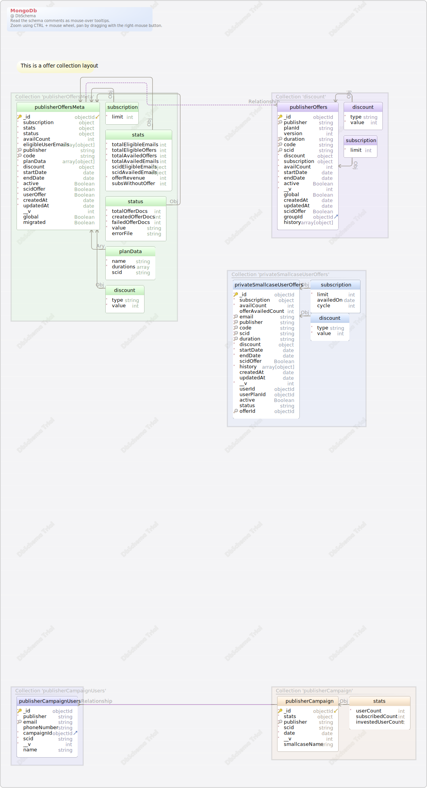

<a name='layout1'># Offer DB Layout #

##Tables

1. [smallcase-staging.privateSmallcaseUserOffers](#smallcase-staging.privateSmallcaseUserOffers) 
2. [smallcase-staging.publisherCampaign](#smallcase-staging.publisherCampaign) 
3. [smallcase-staging.publisherCampaignUsers](#smallcase-staging.publisherCampaignUsers) 
4. [smallcase-staging.publisherOffers](#smallcase-staging.publisherOffers)
5. [smallcase-staging.publisherOffersMeta](#smallcase-staging.publisherOffersMeta) 

<a name='smallcase-staging.privateSmallcaseUserOffers'>### Collection privateSmallcaseUserOffers</a>

This collection used for the private offers which created across the smallcases specific to any users collection&#46;  &#40;this collection gets no of document based on offer meta&#44; if its based for one scid and available for 3 plans so total 3 documents will be created along with the email attached to each offer&#41; ex&#58; one scid have 2 plans eligible for 3 email so no of documents will be 3&#42;2 &#61; 6  Also it will take data from publisherOffers at the time when any user availed the public offer so that time the document will be created wrt to the user trying to avail the offer&#46;

| Idx | Field Name | Data Type | Description |
|---|---|---|---|
| *🔑 | <a name='smallcase-staging.privateSmallcaseUserOffers__id'>&#95;id</a>| objectId  |  |
| *| <a name='smallcase-staging.privateSmallcaseUserOffers_subscription'>subscription</a>| object  | no of times it can be used at the time of renewal |
| *| <a name='smallcase-staging.privateSmallcaseUserOffers_subscription.limit'>subscription&#46;limit</a>| int  |  |
|  | <a name='smallcase-staging.privateSmallcaseUserOffers_subscription.availedOn'>subscription&#46;availedOn</a>| date  |  |
|  | <a name='smallcase-staging.privateSmallcaseUserOffers_subscription.cycle'>subscription&#46;cycle</a>| int  |  |
| *| <a name='smallcase-staging.privateSmallcaseUserOffers_availCount'>availCount</a>| int  |  |
|  | <a name='smallcase-staging.privateSmallcaseUserOffers_offerAvailedCount'>offerAvailedCount</a>| int  | current stats of offer availed |
| *🔍 | <a name='smallcase-staging.privateSmallcaseUserOffers_email'>email</a>| string  | email for which offer is enabled |
| *🔍 | <a name='smallcase-staging.privateSmallcaseUserOffers_publisher'>publisher</a>| string  | manager&#47;publisher offer curator&#46; |
| *🔍 | <a name='smallcase-staging.privateSmallcaseUserOffers_code'>code</a>| string  |  |
| *🔍 | <a name='smallcase-staging.privateSmallcaseUserOffers_scid'>scid</a>| string  |  |
| *🔍 | <a name='smallcase-staging.privateSmallcaseUserOffers_duration'>duration</a>| string  | duration for which this offer is linked to user |
| *| <a name='smallcase-staging.privateSmallcaseUserOffers_discount'>discount</a>| object  | type and number of discount |
| *| <a name='smallcase-staging.privateSmallcaseUserOffers_discount.type'>discount&#46;type</a>| string  |  |
| *| <a name='smallcase-staging.privateSmallcaseUserOffers_discount.value'>discount&#46;value</a>| int  |  |
| *| <a name='smallcase-staging.privateSmallcaseUserOffers_startDate'>startDate</a>| date  |  |
| *| <a name='smallcase-staging.privateSmallcaseUserOffers_endDate'>endDate</a>| date  |  |
|  | <a name='smallcase-staging.privateSmallcaseUserOffers_scidOffer'>scidOffer</a>| Boolean  | if this is scid offer |
| *| <a name='smallcase-staging.privateSmallcaseUserOffers_history'>history</a>| array&#91;object&#93;  |  |
|  | <a name='smallcase-staging.privateSmallcaseUserOffers_createdAt'>createdAt</a>| date  |  |
|  | <a name='smallcase-staging.privateSmallcaseUserOffers_updatedAt'>updatedAt</a>| date  |  |
| *| <a name='smallcase-staging.privateSmallcaseUserOffers___v'>&#95;&#95;v</a>| int  |  |
|  | <a name='smallcase-staging.privateSmallcaseUserOffers_userId'>userId</a>| objectId  | user Id for which this user is offer available |
|  | <a name='smallcase-staging.privateSmallcaseUserOffers_userPlanId'>userPlanId</a>| objectId  |  |
|  | <a name='smallcase-staging.privateSmallcaseUserOffers_active'>active</a>| Boolean  | if this is active |
|  | <a name='smallcase-staging.privateSmallcaseUserOffers_status'>status</a>| string  | status of the current offer if its expired&#47;availed |
| 🔍 | <a name='smallcase-staging.privateSmallcaseUserOffers_offerId'>offerId</a>| objectId  | group Id from meta collection to map it with the current Offer |
| Indexes |
| 🔑 | &#95;id&#95; || ON &#95;id |  |
| 🔍  | offerId&#95;1 || ON offerId |  |
| 🔍  | email&#95;1 || ON email |  |
| 🔍  | email&#95;1&#95;publisher&#95;1&#95;code&#95;1&#95;scid&#95;1&#95;duration&#95;1 || ON email&#44; publisher&#44; code&#44; scid&#44; duration |  |

<a name='smallcase-staging.publisherCampaign'>### Collection publisherCampaign </a>

| Idx | Field Name | Data Type |
|---|---|---|
| *🔑 ⬋ | <a name='smallcase-staging.publisherCampaign__id'>&#95;id</a>| objectId  |
| *| <a name='smallcase-staging.publisherCampaign_stats'>stats</a>| object  |
| *| <a name='smallcase-staging.publisherCampaign_stats.userCount'>stats&#46;userCount</a>| int  |
|  | <a name='smallcase-staging.publisherCampaign_stats.subscribedCount'>stats&#46;subscribedCount</a>| int  |
|  | <a name='smallcase-staging.publisherCampaign_stats.investedUserCount'>stats&#46;investedUserCount</a>| int  |
| *🔍 | <a name='smallcase-staging.publisherCampaign_publisher'>publisher</a>| string  |
| *| <a name='smallcase-staging.publisherCampaign_scid'>scid</a>| string  |
| *| <a name='smallcase-staging.publisherCampaign_date'>date</a>| date  |
| *| <a name='smallcase-staging.publisherCampaign___v'>&#95;&#95;v</a>| int  |
|  | <a name='smallcase-staging.publisherCampaign_smallcaseName'>smallcaseName</a>| string  |
| Indexes |
| 🔑 | &#95;id&#95; || ON &#95;id|
| 🔍  | publisher&#95;1 || ON publisher|

### Collection publisherCampaignUsers 
| Idx | Field Name | Data Type |
|---|---|---|
| *🔑 | <a name='smallcase-staging.publisherCampaignUsers__id'>&#95;id</a>| objectId  |
| *| <a name='smallcase-staging.publisherCampaignUsers_publisher'>publisher</a>| string  |
| *🔍 | <a name='smallcase-staging.publisherCampaignUsers_email'>email</a>| string  |
|  | <a name='smallcase-staging.publisherCampaignUsers_phoneNumber'>phoneNumber</a>| string  |
| *⬈ | <a name='smallcase-staging.publisherCampaignUsers_campaignId'>campaignId</a>| objectId  |
| *| <a name='smallcase-staging.publisherCampaignUsers_scid'>scid</a>| string  |
| *| <a name='smallcase-staging.publisherCampaignUsers___v'>&#95;&#95;v</a>| int  |
|  | <a name='smallcase-staging.publisherCampaignUsers_name'>name</a>| string  |
| Indexes |
| 🔑 | &#95;id&#95; || ON &#95;id|
| 🔍  | email&#95;1 || ON email|
| Relationships |
| Vir | Relationship | ( campaignId ) ref [smallcase&#45;staging&#46;publisherCampaign](#publisherCampaign) (&#95;id) |

<a name='smallcase-staging.publisherOffers'>### Collection publisherOffers</a>

This collection used for the public offers which created across the smallcases not specific to any users&#46;  &#40;this collection gets no of document based on offer meta&#44; if its based for one scid and available for 3 plans so total 3 documents will be created&#41;

| Idx | Field Name | Data Type | Description |
|---|---|---|---|
| *🔑 | <a name='smallcase-staging.publisherOffers__id'>&#95;id</a>| objectId  |  |
| *🔍 | <a name='smallcase-staging.publisherOffers_publisher'>publisher</a>| string  | publisher name |
|  | <a name='smallcase-staging.publisherOffers_planId'>planId</a>| string  | planId of the specific plan for this offer is created&#46; |
|  | <a name='smallcase-staging.publisherOffers_version'>version</a>| int  |  |
| *🔍 | <a name='smallcase-staging.publisherOffers_duration'>duration</a>| string  |  |
| *🔍 | <a name='smallcase-staging.publisherOffers_code'>code</a>| string  |  |
| 🔍 | <a name='smallcase-staging.publisherOffers_scid'>scid</a>| string  | id of the smallcase&#46; |
| *| <a name='smallcase-staging.publisherOffers_discount'>discount</a>| object  | discount info like type of discount and number |
| *| <a name='smallcase-staging.publisherOffers_discount.type'>discount&#46;type</a>| string  |  |
| *| <a name='smallcase-staging.publisherOffers_discount.value'>discount&#46;value</a>| int  |  |
| *| <a name='smallcase-staging.publisherOffers_subscription'>subscription</a>| object  | no of times this offer code can be used in the renewal cycle&#46; |
| *| <a name='smallcase-staging.publisherOffers_subscription.limit'>subscription&#46;limit</a>| int  |  |
| *| <a name='smallcase-staging.publisherOffers_availCount'>availCount</a>| int  | no of times it can be availed in the fresh subscription&#46; |
| *| <a name='smallcase-staging.publisherOffers_startDate'>startDate</a>| date  |  |
| *| <a name='smallcase-staging.publisherOffers_endDate'>endDate</a>| date  |  |
| *| <a name='smallcase-staging.publisherOffers_active'>active</a>| Boolean  | if the offer is active or not&#46; |
| *| <a name='smallcase-staging.publisherOffers___v'>&#95;&#95;v</a>| int  |  |
|  | <a name='smallcase-staging.publisherOffers_global'>global</a>| Boolean  |  |
|  | <a name='smallcase-staging.publisherOffers_createdAt'>createdAt</a>| date  |  |
|  | <a name='smallcase-staging.publisherOffers_updatedAt'>updatedAt</a>| date  |  |
|  | <a name='smallcase-staging.publisherOffers_scidOffer'>scidOffer</a>| Boolean  | if this is scid based offer |
| ⬈ | <a name='smallcase-staging.publisherOffers_groupId'>groupId</a>| objectId  | id from the offerMeta collection to identify the offer |
|  | <a name='smallcase-staging.publisherOffers_history'>history</a>| array&#91;object&#93;  |  |
| Indexes |
| 🔑 | &#95;id&#95; || ON &#95;id |  |
| 🔍  | publisher&#95;1&#95;code&#95;1&#95;scid&#95;1&#95;duration&#95;1 || ON publisher&#44; code&#44; scid&#44; duration |  |
| Relationships |
| Vir | Relationship | ( groupId ) ref [smallcase&#45;staging&#46;publisherOffersMeta](#publisherOffersMeta) (&#95;id) |  |

<a name='smallcase-staging.publisherOffersMeta'>### Collection publisherOffersMeta </a>

This collection used for the offer level info&#44; this is first collection gives info for the offer created in the database&#46;

| Idx | Field Name | Data Type | Description |
|---|---|---|---|
| *🔑 ⬋ | <a name='smallcase-staging.publisherOffersMeta__id'>&#95;id</a>| objectId  |  |
| *| <a name='smallcase-staging.publisherOffersMeta_subscription'>subscription</a>| object  | used in the renewal time and count no of times |
| *| <a name='smallcase-staging.publisherOffersMeta_subscription.limit'>subscription&#46;limit</a>| int  |  |
| *| <a name='smallcase-staging.publisherOffersMeta_stats'>stats</a>| object  | gives stats like how many user have availed and eligible&#44; revenue&#44; available email&#47;offers |
| *| <a name='smallcase-staging.publisherOffersMeta_stats.totalEligibleEmails'>stats&#46;totalEligibleEmails</a>| int  |  |
| *| <a name='smallcase-staging.publisherOffersMeta_stats.totalEligibleOffers'>stats&#46;totalEligibleOffers</a>| int  |  |
| *| <a name='smallcase-staging.publisherOffersMeta_stats.totalAvailedOffers'>stats&#46;totalAvailedOffers</a>| int  |  |
| *| <a name='smallcase-staging.publisherOffersMeta_stats.totalAvailedEmails'>stats&#46;totalAvailedEmails</a>| int  |  |
|  | <a name='smallcase-staging.publisherOffersMeta_stats.scidEligibleEmails'>stats&#46;scidEligibleEmails</a>| object  |  |
|  | <a name='smallcase-staging.publisherOffersMeta_stats.scidAvailedEmails'>stats&#46;scidAvailedEmails</a>| object  |  |
| *| <a name='smallcase-staging.publisherOffersMeta_stats.offerRevenue'>stats&#46;offerRevenue</a>| int  |  |
|  | <a name='smallcase-staging.publisherOffersMeta_stats.subsWithoutOffer'>stats&#46;subsWithoutOffer</a>| int  |  |
| *| <a name='smallcase-staging.publisherOffersMeta_status'>status</a>| object  |  |
| *| <a name='smallcase-staging.publisherOffersMeta_status.totalOfferDocs'>status&#46;totalOfferDocs</a>| int  | total offer created in progress |
| *| <a name='smallcase-staging.publisherOffersMeta_status.createdOfferDocs'>status&#46;createdOfferDocs</a>| int  | total offer created success&#46; |
| *| <a name='smallcase-staging.publisherOffersMeta_status.failedOfferDocs'>status&#46;failedOfferDocs</a>| int  | total offer failed in creation&#46; |
| *| <a name='smallcase-staging.publisherOffersMeta_status.value'>status&#46;value</a>| string  |  |
|  | <a name='smallcase-staging.publisherOffersMeta_status.errorFile'>status&#46;errorFile</a>| string  | error file in s3 for the failed documents |
| *| <a name='smallcase-staging.publisherOffersMeta_availCount'>availCount</a>| int  | No of times user can avail the offer in the subscribe state &#40;no renewal&#41; |
| *| <a name='smallcase-staging.publisherOffersMeta_eligibleUserEmails'>eligibleUserEmails</a>| array&#91;object&#93;  |  |
| *🔍 | <a name='smallcase-staging.publisherOffersMeta_publisher'>publisher</a>| string  |  |
| *🔍 | <a name='smallcase-staging.publisherOffersMeta_code'>code</a>| string  |  |
| *| <a name='smallcase-staging.publisherOffersMeta_planData'>planData</a>| array&#91;object&#93;  | Gives data like SCID&#44; available plans eligible for the discount&#46; |
| *| <a name='smallcase-staging.publisherOffersMeta_planData.name'>planData&#46;name</a>| string  |  |
| *| <a name='smallcase-staging.publisherOffersMeta_planData.durations'>planData&#46;durations</a>| array  |  |
|  | <a name='smallcase-staging.publisherOffersMeta_planData.scid'>planData&#46;scid</a>| string  |  |
| *| <a name='smallcase-staging.publisherOffersMeta_discount'>discount</a>| object  | discount type with number |
| *| <a name='smallcase-staging.publisherOffersMeta_discount.type'>discount&#46;type</a>| string  |  |
| *| <a name='smallcase-staging.publisherOffersMeta_discount.value'>discount&#46;value</a>| int  |  |
| *| <a name='smallcase-staging.publisherOffersMeta_startDate'>startDate</a>| date  |  |
| *| <a name='smallcase-staging.publisherOffersMeta_endDate'>endDate</a>| date  | expiry date of the code |
| *| <a name='smallcase-staging.publisherOffersMeta_active'>active</a>| Boolean  |  |
| *| <a name='smallcase-staging.publisherOffersMeta_scidOffer'>scidOffer</a>| Boolean  | true if its SCID based offer |
| *| <a name='smallcase-staging.publisherOffersMeta_userOffer'>userOffer</a>| Boolean  | true if this offer is for specific user |
| *| <a name='smallcase-staging.publisherOffersMeta_createdAt'>createdAt</a>| date  |  |
| *| <a name='smallcase-staging.publisherOffersMeta_updatedAt'>updatedAt</a>| date  |  |
|  | <a name='smallcase-staging.publisherOffersMeta___v'>&#95;&#95;v</a>| int  |  |
|  | <a name='smallcase-staging.publisherOffersMeta_global'>global</a>| Boolean  |  |
|  | <a name='smallcase-staging.publisherOffersMeta_migrated'>migrated</a>| Boolean  |  |
| Indexes |
| 🔑 | &#95;id&#95; || ON &#95;id |  |
| 🔍  | publisher&#95;1&#95;code&#95;1 || ON publisher&#44; code |  |

